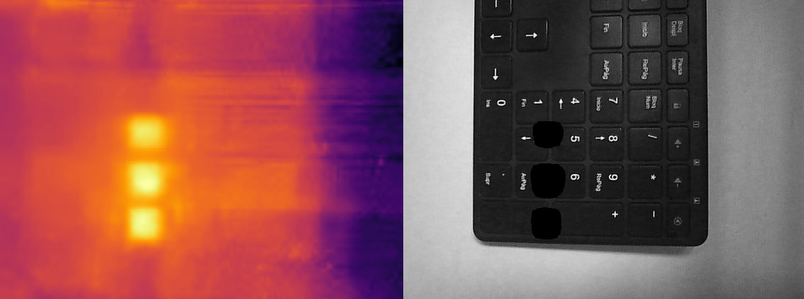

# Thermal number finder

The goal here is to find the numbers touched from a thermal photo

## Goals

- Detect where are the numbers in the photo
- Detect what numbers where touched
- Detect the order of the numbers touched

## Requirements

* Python 3.7+
* Requirements = Requirement.txt
```bash
$ pip install -r requirements.txt
```
###### flirimageextractor (1.4.0)
###### matplotlib (3.3.4)
###### numpy (1.21.3)
###### opencv_python (4.5.3.56)
###### Pillow (8.4.0)

## Usage

#### Detecting center's of each number (Generating a pickle file)

```bash
$ python detection_digit_position.py
```

#### Predict number touched of an thermal image

```bash
$ python thermal_detection.py --file=./CODIGOS_ETIQUETADOS/DIGITOS_020.jpg
```

#### (Bonus) See image used and thermal value

```bash
$ python manual_digit_reader.py --file=./CODIGOS_ETIQUETADOS/DIGITOS_001.jpg
```

## Example



## Authors

* **PÉREZ GARCÍA DE LA PUENTE, NATALIA LOURDES** - *Member 1* - [Natalia](https://github.com/natalialperez)
* **GILABERT MAÑO, VICENTE** - *Member 2* - [Vicent](https://github.com/vgilabert94)
* **ROSARIO TREMOULET, LUIS** - *Member 3* - [Luis](https://github.com/Luisrosario2604)
